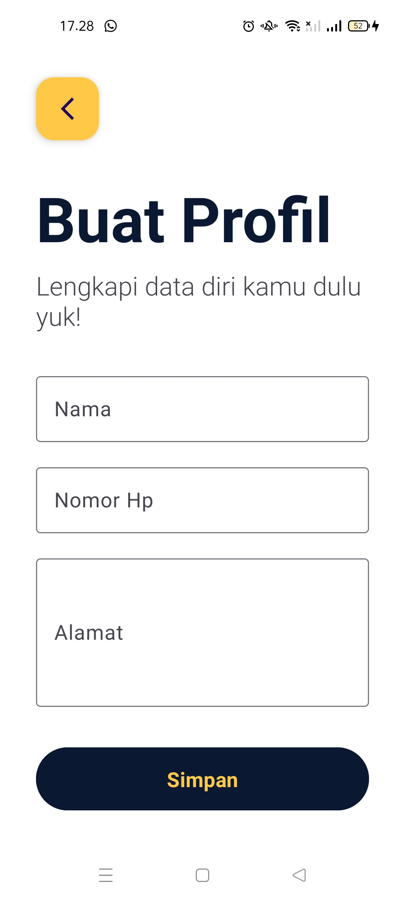
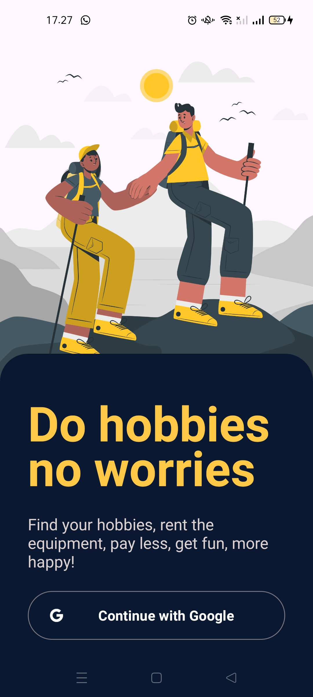
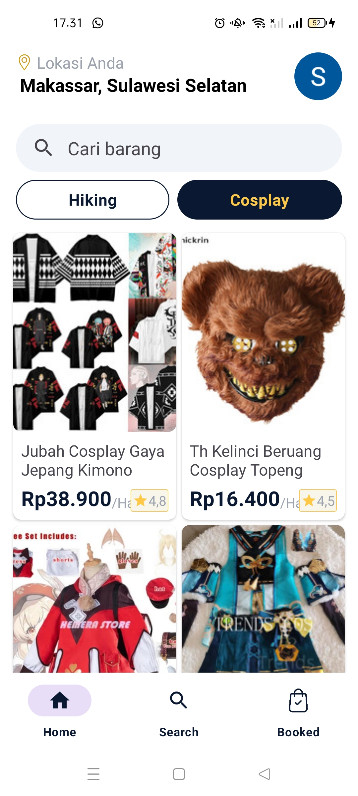
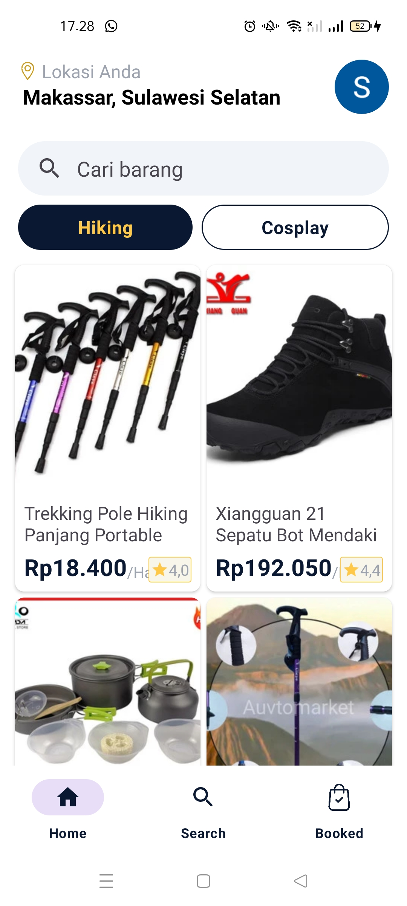
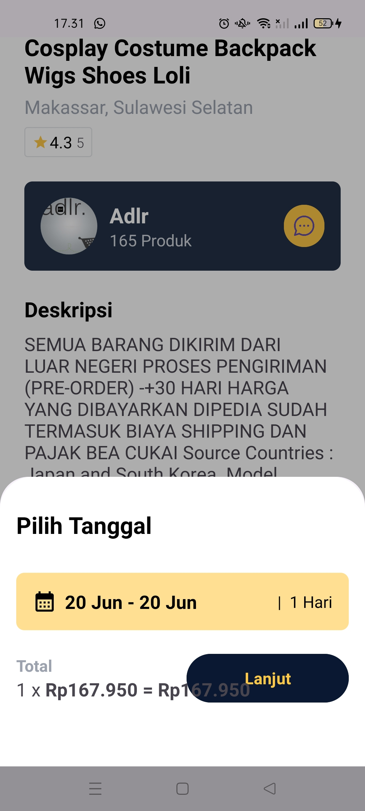
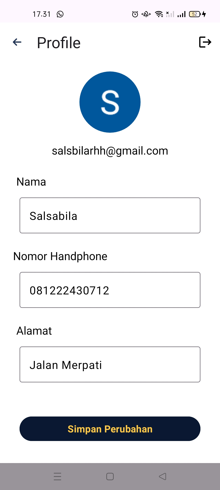

# RentBy Mobile App


RentBy is a mobile application designed to facilitate the rental process. Users can browse, book, and manage their rentals seamlessly. This repository contains the source code for the RentBy mobile application built using Android and Kotlin.

## Table of Contents

- [Features](#features)
- [Screenshots](#screenshots)
- [Requirements](#requirements)
- [Installation](#installation)
- [Usage](#usage)
- [Contributing](#contributing)
- [License](#license)

## Features

- User authentication and profile management
- Browse and search rental listings
- Book and manage rentals
- View booking details and status
- Integrated payment system
- Real-time notifications

## Screenshots










![BookedList_Screen]


![Seller_Screen]


## Requirements

- Android Studio
- Android SDK
- Kotlin

## Installation

To get a local copy up and running, follow these steps:

1. Clone the repository:
    ```sh
    git clone https://github.com/Rentby/rentby-mobile-app.git
    ```

2. Open the project in Android Studio.

3. Sync the project with Gradle files:
    - Go to `File > Sync Project with Gradle Files`.

4. Set up Firebase for the project:
    - Go to the [Firebase Console](https://console.firebase.google.com/).
    - Create a new project or use an existing project.
    - Add an Android app to your project.
    - Download the `google-services.json` file and place it in the `app` directory of your project.

5. Build and run the project on an emulator or a physical device.

## Usage

- Register or log in to your account.
- Browse the available rental listings.
- Book a rental by selecting the desired dates.
- Manage your bookings from the profile section.
- View booking details and statuses in the orders section.
- Make payments securely within the app.

## License

Distributed under the MIT License. See `LICENSE` for more information.

## Contact

- **Project Link:** [RentBy Mobile App](https://github.com/Rentby/rentby-mobile-app)
- **Contributors:** [List of contributors](https://github.com/Rentby/rentby-mobile-app/graphs/contributors)

---

<p align="center">
    Made by the RentBy Team
</p>
